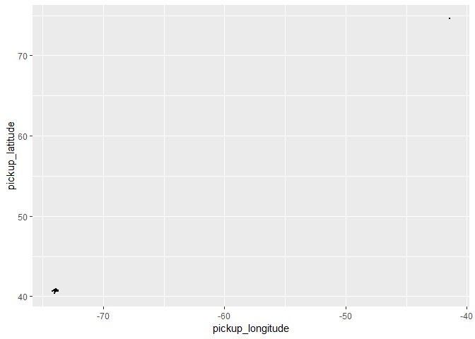
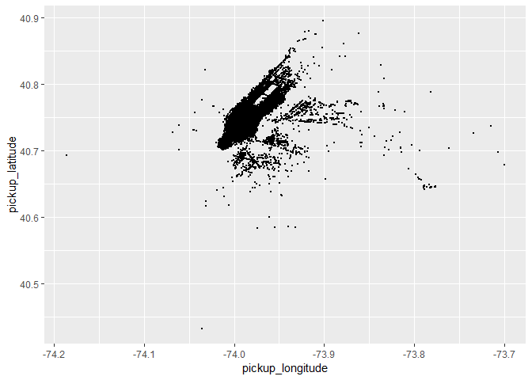
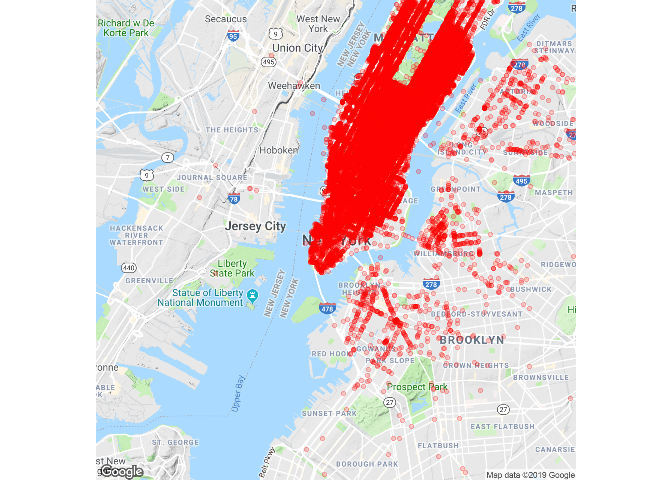
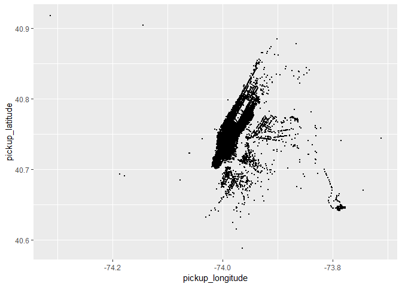
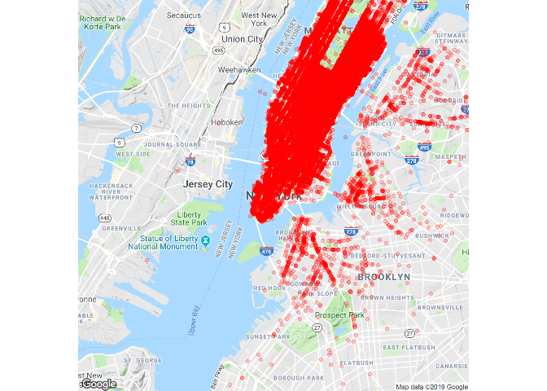
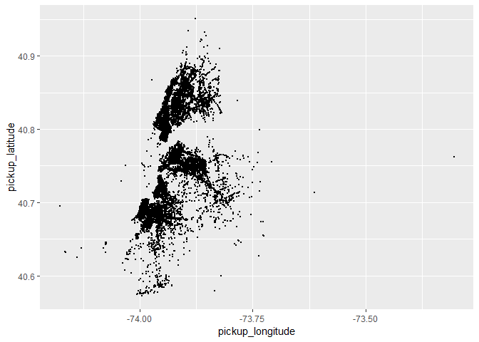
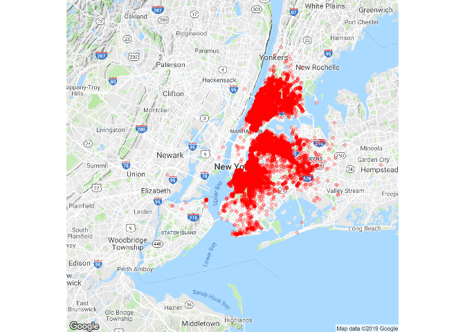
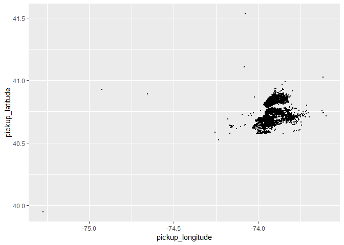
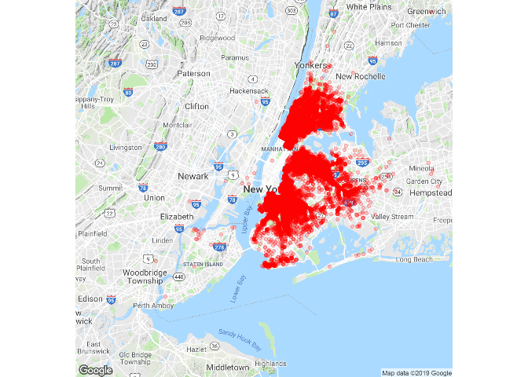
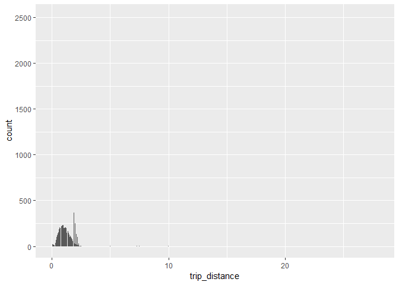

CLEAN DATA
----------

The python scripts read the data from [Google Big
Query](https://bigquery.cloud.google.com) and creates four csv files

[yellow\_2014.csv](https://github.com/celinakhalife/capstoneProject/blob/master/yellow_2014.csv)
[yellow\_2015.csv](https://github.com/celinakhalife/capstoneProject/blob/master/yellow_2015.csv)
[green\_2014.csv](https://github.com/celinakhalife/capstoneProject/blob/master/green_2014.csv)
[green\_2015.csv](https://github.com/celinakhalife/capstoneProject/blob/master/green_2015.csv)

Since I'm dealing with a large dataset, dropping empty fields rows will
not impact my modal. In fact, I will be able to create a more truthful
analysis and prediction modal. That's why, I decided to drop the records
with missing fields like pickup\_longitude, pickup\_latitude,
dropoff\_longitude, dropoff\_latitude, fare\_amount, trip\_distance and
pickup\_datetime.

As a first step, I decided to visualize the selected pickup\_longitude
and pickup\_latitude using the `ggplot` library.

    yellowData2014 <- read.csv('../yellow_2014.csv', stringsAsFactors = FALSE)
    plot <- ggplot(yellowData2014, aes(x=pickup_longitude, y=pickup_latitude)) +
      geom_point(size=0.06)
    plot

As you can see, it appears that some locations are way off. To remove
those records from the dataset, I calculated the distance as the Crow
Flies of each pickup location to the center of New York City and removed
all rows with a distance higher than 100miles.

    newYorkLatLng = c(-73.935242, 40.730610)
    yellowData2014 <- yellowData2014  %>% mutate(
      distance_from_center = mapply(function(lg, lt) distm(newYorkLatLng, c(lg, lt), fun=distHaversine), pickup_longitude, pickup_latitude)/ 1609
    )
    yellowData2014 <- yellowData2014[yellowData2014$distance_from_center < 100,]

    plot <- ggplot(yellowData2014, aes(x=pickup_longitude, y=pickup_latitude)) +
      geom_point(size=0.06) +
      scale_x_continuous(limits=c(min_long, max_long)) +
      scale_y_continuous(limits=c(min_lat, max_lat)) 

    plot

Displaying the pickup longitude and latitude of yellow taxi 2014 on New
York city using `ggmap`

    ggmap(get_map("New York",
                  zoom = 12, scale = "auto",
                  source = "google"),
          extent="device",
          legend="topright"
    ) + geom_point(aes(x=pickup_longitude, y=pickup_latitude), 
                   data=yellowData2014, 
                   col="red", alpha=0.2
    )

    ## Source : https://maps.googleapis.com/maps/api/staticmap?center=New%20York&zoom=12&size=640x640&scale=2&maptype=terrain&language=en-EN&key=xxx

    ## Source : https://maps.googleapis.com/maps/api/geocode/json?address=New+York&key=xxx

Running the same as above on the yellow 2015 data will result in the
following error

    yellowData2015 <- yellowData2015  %>% mutate(
      distance_from_center = mapply(function(lg, lt) distm(newYorkLatLng, c(lg, lt), fun=distHaversine), pickup_longitude, pickup_latitude)/ 1609
    )
    Error in .pointsToMatrix(y) : longitude < -360

I had to remove all latitude and longitude values that are not within
the maximum bounds \* Latitude: -85 to +85 \* Longitude: -180 to +180

    yellowData2015 <- yellowData2015[yellowData2015$pickup_latitude >= -85 & yellowData2015$pickup_latitude <= 85,]
    yellowData2015 <- yellowData2015[yellowData2015$pickup_longitude >= -180 & yellowData2015$pickup_longitude <= 180,]

Running the same script again would display the following plot

Displaying the pickup longitude and latitude of yellow taxi 2015 on New
York city using `ggmap`

    ## Source : https://maps.googleapis.com/maps/api/staticmap?center=New%20York&zoom=12&size=640x640&scale=2&maptype=terrain&language=en-EN&key=xxx

    ## Source : https://maps.googleapis.com/maps/api/geocode/json?address=New+York&key=xxx

I repeat the same process on the green taxi data-sets

Green taxi 2014

      # draw pickup data on google maps
      ggmap(get_map("New York",
                    zoom = 10, scale = "auto",
                    source = "google"),
            extent="device",
            legend="topright"
      ) + geom_point(aes(x=pickup_longitude, y=pickup_latitude), 
                     data=greenData2014, 
                     col="red", alpha=0.2
      ) 

    ## Source : https://maps.googleapis.com/maps/api/staticmap?center=New%20York&zoom=10&size=640x640&scale=2&maptype=terrain&language=en-EN&key=xxx

    ## Source : https://maps.googleapis.com/maps/api/geocode/json?address=New+York&key=xxx

Green taxi 2015

      # draw pickup data on google maps
      ggmap(get_map("New York",
                    zoom = 10, scale = "auto",
                    source = "google"),
            extent="device",
            legend="topright"
      ) + geom_point(aes(x=pickup_longitude, y=pickup_latitude), 
                     data=greenData2015, 
                     col="red", alpha=0.2
      )

    ## Source : https://maps.googleapis.com/maps/api/staticmap?center=New%20York&zoom=10&size=640x640&scale=2&maptype=terrain&language=en-EN&key=xxx

    ## Source : https://maps.googleapis.com/maps/api/geocode/json?address=New+York&key=xxx

I run the same process on the dropoff latitude and longitude of all four
data-sets and write the clean data-sets in four csv files

[clean\_yellow\_2014.csv](https://github.com/celinakhalife/capstoneProject/blob/master/clean_yellow_2014.csv)
[clean\_yellow\_2015.csv](https://github.com/celinakhalife/capstoneProject/blob/master/clean_yellow_2015.csv)
[clean\_green\_2014.csv](https://github.com/celinakhalife/capstoneProject/blob/master/clean_green_2014.csv)
[clean\_green\_2015.csv](https://github.com/celinakhalife/capstoneProject/blob/master/clean_green_2015.csv)

WRANGLE DATA
------------

Extract Date & Time Attributes from pickup\_datetime and
dropoff\_datetime fields

      data <- data %>% mutate(
        pickup_year = mapply(function(datetime) as.POSIXlt(datetime)$year+1900 , pickup_datetime),
        pickup_month = mapply(function(datetime) as.POSIXlt(datetime)$mon+1 , pickup_datetime),
        pickup_day = mapply(function(datetime) as.POSIXlt(datetime)$mday , pickup_datetime),
        pickup_hour = mapply(function(datetime) as.POSIXlt(datetime)$hour , pickup_datetime),
        pickup_minute = mapply(function(datetime) as.POSIXlt(datetime)$min , pickup_datetime)
      ) 

      data <- data %>% mutate(
        dropoff_year = mapply(function(datetime) as.POSIXlt(datetime)$year+1900 , dropoff_datetime),
        dropoff_month = mapply(function(datetime) as.POSIXlt(datetime)$mon+1 , dropoff_datetime),
        dropoff_day = mapply(function(datetime) as.POSIXlt(datetime)$mday , dropoff_datetime),
        dropoff_hour = mapply(function(datetime) as.POSIXlt(datetime)$hour , dropoff_datetime),
        dropoff_minute = mapply(function(datetime) as.POSIXlt(datetime)$min , dropoff_datetime)
        
        )

Explore Data
------------

As a first step, I decided to create a scatter plot matrix of
`yellowdata2014` containing the three variables `pickup_hour`,
`fare_amount` and `trip_distance`

    selectedColumns <- c("pickup_hour",
                         "fare_amount", "trip_distance")
    view <- yellowData2014[ ,(names(yellowData2014) %in% selectedColumns)]
    pairs.panels(view, 
                 method = "pearson",
                 hist.col = "#00AFBB",
                 density = TRUE,
                 ellipses = TRUE
    )

It's clear that there's a correlation between `fare_amount` and
`trip_distance` and that `trip_distance` is usually below 5miles.

I decided to create a bar histogram of the `trip_distance` to make sure
that's the case and remove all values above 5miles

    ggplot(yellowData2014, aes(x=trip_distance)) +
      xlim(min(yellowData2014$trip_distance), max(yellowData2014$trip_distance)) +
      geom_bar()

