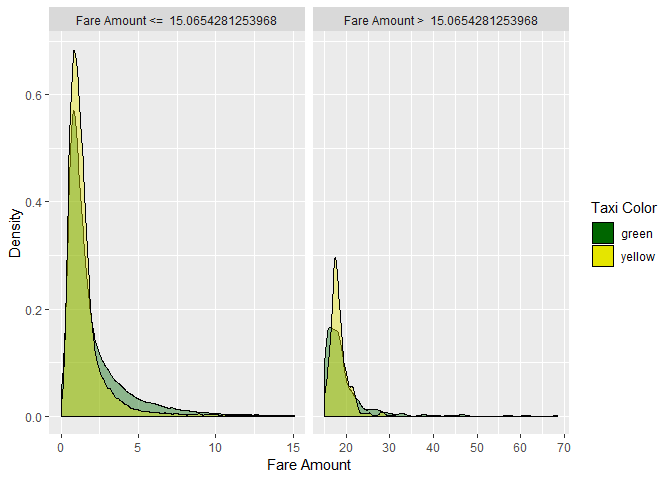
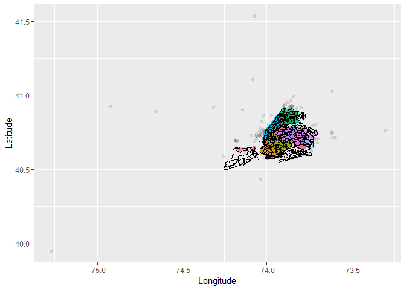
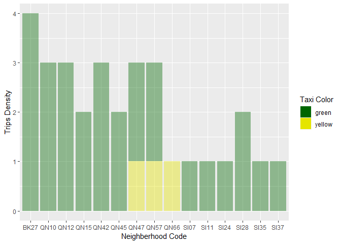

EXPLORE DATA
------------

### Working with Yellow and Green datasets

I wanted to visualize the density of the `trip_distance`, I used
`quantile` to set the `trip_distance` threshold with a 90% probability.

    taxiData <-
      read.csv('../clean_yellow_green_data.csv', stringsAsFactors = FALSE)

    threshold <- quantile(taxiData$trip_distance, probs=0.9)

    ggplot(taxiData, aes(x=trip_distance, fill=taxi_color, alpha=I(0.4))) + 
      xlim(min(taxiData$trip_distance),max(taxiData$trip_distance)) +
      geom_density() + 
      geom_vline(xintercept=threshold) +
      scale_fill_manual(values=c("#006600", "#e5e500")) +
      labs(fill = 'Taxi Color', x = 'Trip Distance (in miles)', y = 'Density')

The trip distance threshold is 3.8 miles I decided to create a discrete
modal with the new trip distance threshold

    distance_type_label <- c('TRUE' = paste('Trip Distance > ', threshold), 'FALSE' = paste('Trip Distance <= ', threshold))
    ggplot(transform(taxiData,
                     long_distance = trip_distance > threshold), aes(x=trip_distance, fill=taxi_color, alpha=I(0.4))) + 
      geom_density() + 
      scale_fill_manual(values=c("#006600", "#e5e500")) +
      facet_grid (~long_distance,scales = "free", labeller=as_labeller(distance_type_label)) +
      labs(fill = 'Taxi Color', x = 'Trip Distance (in miles)', y = 'Density')

Running the same logic on `fare_amount` values

    taxiData <-
      read.csv('../clean_yellow_green_data.csv', stringsAsFactors = FALSE)

    threshold <- quantile(taxiData$fare_amount, probs=0.9)

    ggplot(taxiData, aes(x=fare_amount, fill=taxi_color, alpha=I(0.4))) + 
      xlim(min(taxiData$fare_amount),max(taxiData$fare_amount)) +
      geom_density() + 
      geom_vline(xintercept=threshold) +
      scale_fill_manual(values=c("#006600", "#e5e500")) +
      labs(fill = 'Taxi Color', x = 'Trip Distance (in miles)', y = 'Density')

`fare_amount` discrete modal

    amount_type_label <- c('TRUE' = paste('Fare Amount > ', threshold), 'FALSE' = paste('Fare Amount <= ', threshold))
    ggplot(transform(taxiData,
                     long_distance = trip_distance > threshold), aes(x=trip_distance, fill=taxi_color, alpha=I(0.4))) + 
      geom_density() + 
      scale_fill_manual(values=c("#006600", "#e5e500")) +
      facet_grid (~long_distance,scales = "free", labeller=as_labeller(amount_type_label)) +
      labs(fill = 'Taxi Color', x = 'Fare Amount', y = 'Density')

Locations
=========

To classify the trip pickup locations, I used the neighborhood grid
provided by
(data.cityofnewyork.us)\[<https://data.cityofnewyork.us/City-Government/Neighborhood-Tabulation-Areas/cpf4-rkhq>\].

    utils::unzip('../neighborhoodTabulationAreas.zip')
    shp <- readOGR(dsn = file.path('../geo_export_3b02421d-4a31-4bc5-ad76-6d5084b470f5.shp'), stringsAsFactors = F)

    ## OGR data source with driver: ESRI Shapefile 
    ## Source: "C:\Users\celin\Documents\capstoneProject\geo_export_3b02421d-4a31-4bc5-ad76-6d5084b470f5.shp", layer: "geo_export_3b02421d-4a31-4bc5-ad76-6d5084b470f5"
    ## with 195 features
    ## It has 7 fields

    map <- ggmap(get_map("New York",
                         zoom = 10, scale = "auto",
                         source = "google"),
                 extent="device",
                 legend="topright"
    )+ geom_point(aes(x=pickup_longitude, y=pickup_latitude, color=taxi_color), 
                  data=taxiData, 
                   alpha=0.2
    )  + 
      geom_polygon(data = shp, aes(x = long, y = lat, group = group), colour = "black", fill = NA) 

    ## Source : https://maps.googleapis.com/maps/api/staticmap?center=New%20York&zoom=10&size=640x640&scale=2&maptype=terrain&language=en-EN&key=xxx

    ## Source : https://maps.googleapis.com/maps/api/geocode/json?address=New+York&key=xxx

    ## Regions defined for each Polygons

    map + theme_void()

I layed the pickup location projections over the neighberhoods shapes
and retreived the neighberhood name and code. I created the same
previous plot with neighberhood color indexes

    spacialTaxiData <- taxiData
    coordinates(spacialTaxiData)=~pickup_longitude+pickup_latitude
    nhood2 = spTransform(shp, CRS("+proj=longlat +datum=WGS84"))

    proj4string(spacialTaxiData) = proj4string(nhood2)
    spacialTaxiData$nhoodID <- over(spacialTaxiData, nhood2)
    taxiData$ntaname <- unlist(spacialTaxiData$nhoodID['ntaname'])
    taxiData$ntacode <- unlist(spacialTaxiData$nhoodID['ntacode'])

    ggplot(taxiData, aes(x=pickup_longitude, y=pickup_latitude)) + 
      geom_point(aes(color=ntacode, alpha=0.2))+ theme(legend.position = "none")  + 
      geom_polygon(data = shp, aes(x = long, y = lat, group = group), colour = "black", fill = NA) +
      labs(x = 'Longitude', y = 'Latitude') 

    ## Regions defined for each Polygons

Summary extracted from the neighberhood data

Highest 15 neighberhoods

    nhoodSummary <- taxiData %>% group_by(ntacode) %>%
      summarise(count=n())
    colnames(nhoodSummary) <- c("ntacode", "value")

    first15NH <- nhoodSummary %>% arrange(desc(value)) %>% head(15) 
    d <- taxiData[taxiData$ntacode %in% first15NH$ntacode,]

    ggplot(d, aes(x=ntacode, fill=taxi_color, alpha=0.4)) +
      geom_bar() + 
      labs(x = 'Neighberhood Code', y = 'Trips Density', fill = 'Taxi Color') +
      scale_fill_manual(values=c("#006600", "#e5e500"))

Lowest 15 neighberhoods

    last15NH <- nhoodSummary %>% arrange(value) %>% head(15) 
    d <- taxiData[taxiData$ntacode %in% last15NH$ntacode,]

    ggplot(d, aes(x=ntacode, fill=taxi_color, alpha=0.4)) +
      geom_bar() + 
      labs(x = 'Neighberhood Code', y = 'Trips Density', fill = 'Taxi Color') +
      scale_fill_manual(values=c("#006600", "#e5e500"))

